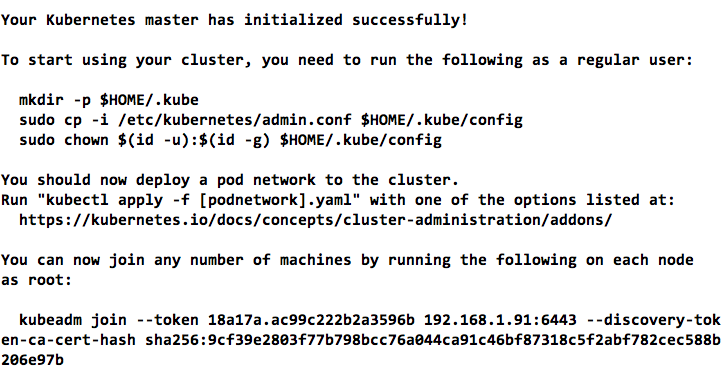

### kubernetes

- kubectl get nodes : 연결된 노드 출력
- kubectl run kubernetes-bootcamp --image=docker.io/jocatalin/kubernetes-bootcamp:v1 --port=8080  -> deployment 실행
- kubectl get deployments
- kubectl proxy : 호스트-kubernetes cluster 연결 : direct access to the API 라고 한다
- export POD_NAME=$(kubectl get pods -o go-template --template '{{range .items}}{{.metadata.name}}{{"\n"}}{{end}}') -> pod name 

- kubectl get pods : pods 보기
- kubectl describe pods : 자세히
- kubectl logs $POD_NAME : 로그
- kubectl exec $POD_NAME env : 컨테이너 내에서 env 명령어를 실행해서 출력
- kubectl exec -ti $POD_NAME bash -> docker exec bash랑 같은 방식

- kubectl get services : services 출력
- kubectl expose deployment/kubernetes-bootcamp --type="NodePort" --port 8080 : EXPOSE 8080과 같은 동작

  > pods에 서비스를 걸어야 각각 pod 에 외부에서 접근가능
  > deployment 가 replica 2 일 때 deployment에 서비스를 걸면 2개 pods 에 랜덤으로 접근

- kubectl scale deployments/DEPLOYMENT_NAME --replicas=4 하면 Pods 가 4개 생성됨 Deployments 안에 Pods 있음

- kubectl set image deployments/kubernetes-bootcamp kubernetes-bootcamp=jocatalin/kubernetes-bootcamp:v2  -> 기존 컨테이너는 종료되고 새로운 이미지로 컨테이너를 새로 생성 (Pods도 종료되고 새로)

- kubectl describe services/kubernetes-bootcamp
- kubectl describe deployments/deployment1

- NodePort 로 expose 후 curl IP:$NODE_PORT -> 웹서비스 결과 확인

- kubectl rollout status deployments/kubernetes-bootcamp -> roll out 됨 commit 비슷한거 같은 것으로 추정

- kubectl create deployment nginx --image nginx 
 = kubectl run nginx --image nginx

# Kubernetes 설치 테스트

https://kubernetes.io/docs/setup/independent/install-kubeadm/

- kubeadm : cluster bootstrap 역할
- kubelet : 클러스터 내 모든 노드에서 실행됨, Pods, container 생성(관리?) 역할
- kubectl : command cli

- Docker version : docker-ce 17.03
<pre><code>apt-get update && apt-get install -y docker-ce=$(apt-cache madison docker-ce | grep 17.03 | head -1 | awk '{print $3}’)
apt-get install -y nvidia-docker2=2.0.0+docker17.03.2-1
</code></pre>

1. install kubeadm, kubectl, kubelet
<pre><code>apt-get update && apt-get install -y apt-transport-https
curl -s https://packages.cloud.google.com/apt/doc/apt-key.gpg | apt-key add -
cat <<EOF >/etc/apt/sources.list.d/kubernetes.list
deb http://apt.kubernetes.io/ kubernetes-xenial main
EOF
apt-get update
apt-get install -y kubelet kubeadm kubectl
</code></pre>

2. master node 초기화
<pre><code>iptables -F
swapoff -a
kubeadm init</code></pre>

<pre><code>export KUBECONFIG=/etc/kubernetes/admin.conf
</code></pre>

3. pod network 설치

- pod 끼리 통신할 때 필요
- For flannel to work correctly, --pod-network-cidr=10.244.0.0/16 has to be passed to kubeadm init.
flannel works on amd64, arm, arm64 and ppc64le, but for it to work on a platform other than amd64 you have to manually download the manifest and replace amd64 occurences with your chosen platform.
Set /proc/sys/net/bridge/bridge-nf-call-iptables to 1 by running sysctl net.bridge.bridge-nf-call-iptables=1 to pass bridged IPv4 traffic to iptables’ chains. This is a requirement for some CNI plugins to work, for more information please see here.

<pre><code>kubectl apply -f https://raw.githubusercontent.com/coreos/flannel/v0.9.1/Documentation/kube-flannel.yml
</code></pre>

4. cluster 접속

<pre><code>kubeadm join --token <token> <master-ip>:<master-port> --discovery-token-ca-cert-hash sha256:<hash>
</code></pre>

** master에 pod 올릴 때

<pre><code>kubectl taint nodes --all node-role.kubernetes.io/master-
</code></pre>
